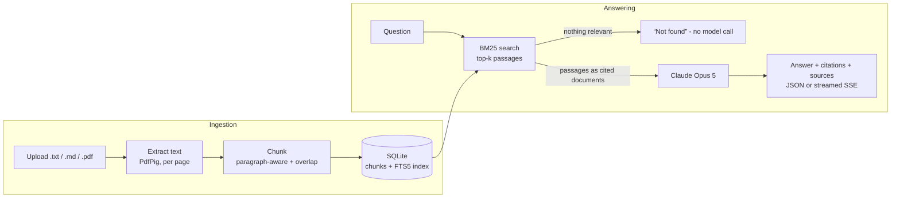

# DocuMind

[](https://github.com/ebrahimmorkas/documind-rag-api/actions/workflows/ci.yml)


**Ask questions about your documents and get answers with citations.** DocuMind is a retrieval-augmented generation (RAG) API built with **.NET 10**: upload text, Markdown or PDF files, and every answer points back to the exact passages it came from.

## How it works



1. **Ingestion**: files are validated, de-duplicated by SHA-256, and split into overlapping chunks that never span PDF pages, so citations keep a page number.
2. **Retrieval**: SQLite **FTS5** with **BM25** ranking, a stemming tokenizer and injection-safe query building.
3. **Generation**: the top passages are sent to Claude as `document` blocks with **citations enabled**; the model may answer only from them. The response is split into segments, each linked to verbatim quotes from numbered sources.

## Features

- Upload, list and delete documents (`.txt`, `.md`, `.pdf`, up to 10 MB)
- `GET /api/search`: BM25 keyword search with highlighted snippets
- `POST /api/ask`: grounded answer with citations and numbered sources
- `POST /api/ask/stream`: the same answer streamed as **Server-Sent Events** (`sources` → `text`/`citation` … → `done`)
- Built-in web UI at `/` showing the answer as it streams, with citation markers
- Scalar API reference at `/scalar`
- Works without an API key: search keeps working, and answering returns a clear `503`

## Tech stack

| Concern | Choice |
|---|---|
| API | ASP.NET Core 10 minimal APIs, ProblemDetails, OpenAPI + Scalar |
| LLM | **Claude Opus 5** through the official `Anthropic` C# SDK, document citations, server-side refusal fallbacks |
| Retrieval | SQLite FTS5 (`porter unicode61` tokenizer), BM25 ranking, raw SQL via `Microsoft.Data.Sqlite` |
| PDF | PdfPig |
| Tests | xUnit v3, Shouldly, `WebApplicationFactory`, real SQLite databases, fake answer generator |
| Delivery | Docker (chiseled, non-root), GitHub Actions with a container smoke test |

## Getting started

Get an API key from the [Claude Console](https://console.anthropic.com/).

### Docker

```bash
export ANTHROPIC_API_KEY=sk-ant-...
docker compose up --build
```

Open http://localhost:8080, upload a document and ask a question.

### Locally

Requires the [.NET 10 SDK](https://dotnet.microsoft.com/download).

```bash
export ANTHROPIC_API_KEY=sk-ant-...     # or: dotnet user-secrets set Anthropic:ApiKey sk-ant-... --project src/DocuMind.Api
dotnet run --project src/DocuMind.Api
```

### API examples

```bash
curl -F "file=@employee-handbook.pdf" http://localhost:8080/api/documents

curl "http://localhost:8080/api/search?q=parental+leave"

curl -X POST http://localhost:8080/api/ask \
  -H "Content-Type: application/json" \
  -d '{ "question": "How much parental leave do employees get?" }'
```

Example response (abridged):

```json
{
  "text": "Employees get 16 weeks of paid parental leave.",
  "segments": [
    { "text": "Employees get 16 weeks of paid parental leave.",
      "citations": [{ "sourceNumber": 1, "citedText": "Parental leave: 16 weeks at full pay" }] }
  ],
  "sources": [{ "number": 1, "documentName": "employee-handbook.pdf", "pageNumber": 12 }],
  "grounded": true
}
```

## Design decisions

- **Citations over "trust me".** Native document citations return verbatim quotes with the answer, so users can verify every claim and hallucinations become visible.
- **No model call without evidence.** If retrieval finds nothing, the API answers "not found" directly. This is cheaper, faster and removes the most common source of made-up answers.
- **Lexical retrieval first.** BM25 over FTS5 needs no embedding service or vector database, costs nothing per query and is excellent for exact terms (policy numbers, product names). `SearchService` is the seam for adding vector search later (hybrid retrieval).
- **Safe query building.** User text is reduced to quoted terms, so FTS5 syntax such as `NEAR`, `AND` or stray quotes can't alter or break the query.
- **Streaming with SSE.** .NET 10's `TypedResults.ServerSentEvents` streams tokens and citations as they arrive, so users see the answer build up instead of waiting.
- **Graceful degradation.** Model outages and a missing key map to clear `503` responses; declined requests are handled via `stop_reason` plus server-side fallbacks.

## Tests

```bash
dotnet test
```

No API key is needed: the model is replaced by a fake `IAnswerGenerator`, and the Claude request itself is verified by inspecting the built request.

## Project structure

```
src/
  DocuMind.Core
    Ingestion/    Text extraction, chunking, ingestion pipeline
    Storage/      SQLite connection factory, document store + FTS5 schema
    Retrieval/    BM25 search service
    Answering/    AnswerService (RAG orchestration), ClaudeAnswerGenerator
  DocuMind.Api
    Endpoints/    documents, search, ask (+ SSE stream)
    wwwroot/      single-page demo UI
tests/
  DocuMind.Tests
```

## License

[MIT](LICENSE)
